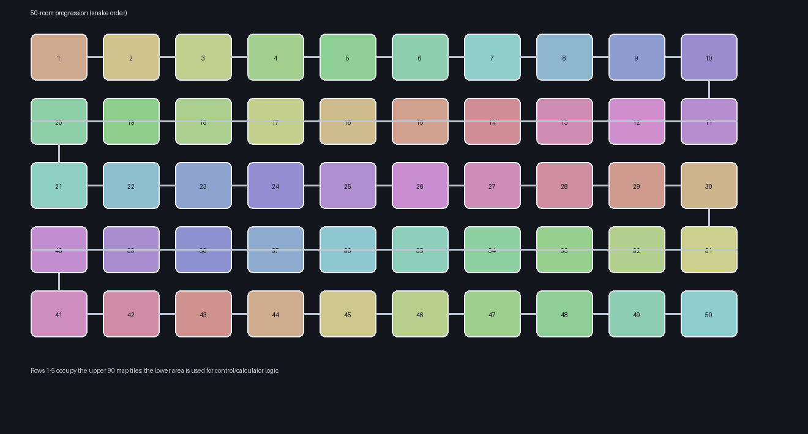
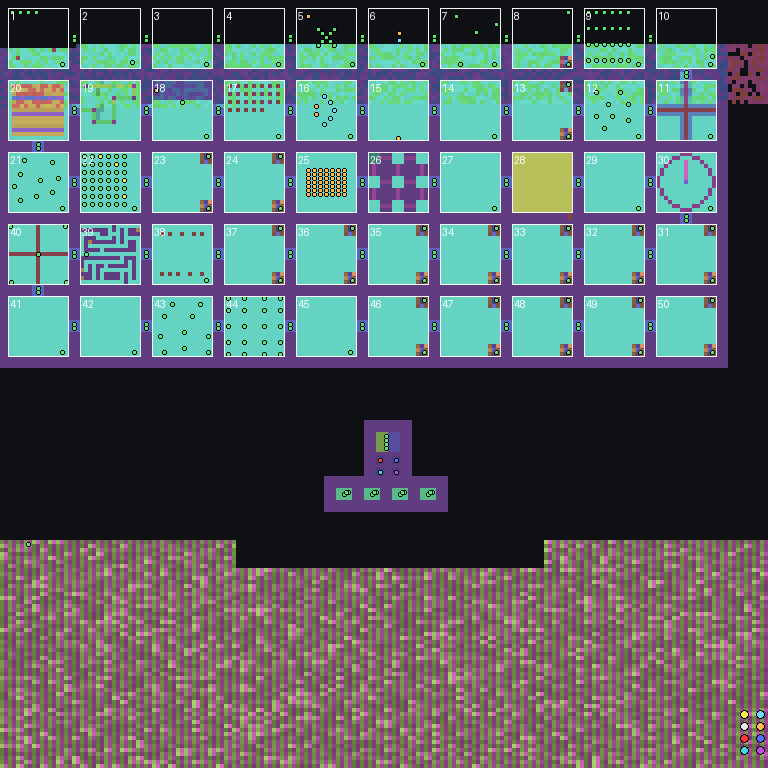

# 미궁[50개의 방] 1.0 전체 구조 분석

> 주의: 아래 스테이지 표에는 정답과 클리어 판정이 포함되어 있습니다.

## 핵심 결론

- 맵 제목: `미궁 - 50개의 방`
- 제작자 표기: `CoOlLuCk-_-`
- 크기/타일셋: 192×192 타일, Installation(ERA 하위 3비트 = 4)
- 진행 구조: 상단의 10열×5행, 총 50개 방을 뱀형 동선으로 순차 진행
- 콘텐츠 규모: 배치 유닛 391개, 스프라이트 58개, 좌표가 있는 로케이션 229개, 트리거 280개
- 게임 로직: 스테이지 완료 트리거 50개를 모두 식별했고, 숫자 입력형 정답 16개를 내부 판정값에서 복원
- 승리 조건: 50번 스위치와 내부 진행 카운터 조건을 만족하면 Trigger 57에서 승리
- 보안/호환성: EUD 메모리 마스크(`SC`)를 쓰는 조건·액션은 없으며, 일반 Death counter는 내부 상태 변수로만 사용

## 맵 설명

총 스테이지 50단계입니다.
전판을 깨셔야 다음 스테이지로 넘어가실 수 있습니다.
Made by CoOlLuCk-_-

## 보호 및 난독화

- MPQ에는 `(listfile)`이 없고, 확인된 6개 파일 블록이 모두 암호화되어 있습니다.
- `scenario.chk`에는 총 66개 섹션이 있으며, 그중 35개는 무작위 4바이트 이름의 무시용 섹션입니다.
- 문자열 섹션은 실제 크기 13,412바이트인데 선언 개수는 65,535개입니다. 참조된 ID만 직접 따라가야 문자열이 정상 복원됩니다.
- `MTXM`은 3회 등장하며 크기는 73,728, 10,102, 526바이트입니다. DIM과 정확히 맞는 1개 섹션만 유효하고 나머지는 검증 실패를 노린 보호용 중복입니다.
- 255개 로케이션의 이름 ID는 난수로 오염됐지만 좌표와 트리거의 로케이션 번호는 정상입니다. 따라서 보고서에서는 `Location N`으로 표시합니다.
- 음수 점프 섹션이나 잘린 섹션은 없고, 핵심 트리거/유닛 데이터는 완전히 순회됩니다.

## 플레이어와 세력

| 슬롯 | 컨트롤러 | 종족 | Force | 색상 ID | 배치 유닛 |
|---:|---|---|---:|---:|---:|
| P1 | Human (Open Slot) | Zerg | 1 | 0 | 3 |
| P2 | Human (Open Slot) | Zerg | 1 | 1 | 3 |
| P3 | Human (Open Slot) | Zerg | 1 | 2 | 3 |
| P4 | Human (Open Slot) | Zerg | 1 | 3 | 3 |
| P5 | Computer | Zerg | 3 | 10 | 56 |
| P6 | Computer | Zerg | 3 | 15 | 7 |
| P7 | Computer | Terran | 2 | 6 | 1 |
| P8 | Computer | Zerg | 3 | 11 | 5 |
| P9 | Inactive | Inactive | - | - | 0 |
| P10 | Inactive | Inactive | - | - | 0 |
| P11 | Inactive | Inactive | - | - | 0 |
| P12 | Inactive | Neutral | - | - | 310 |

세력 설정:

- Force 1: 'Player[Need Full]'; flags `0x0E` (Allies, Allied victory, Shared vision)
- Force 2: 'Made by CoOlLuCk-_-'; flags `0x0E` (Allies, Allied victory, Shared vision)
- Force 3: "'ㅅ'"; flags `0x08` (Shared vision)
- Force 4: 'Force 4'; flags `0x0F` (Random start, Allies, Allied victory, Shared vision)

## 스테이지별 실제 클리어 판정

숫자형은 맵이 비교하는 광물값을 정답으로 표시했습니다. 그 외는 완료 트리거의 모든 조건을 그대로 요약했습니다.

| Stage | 방 좌표(행,열) | 숫자 정답 | 실제 판정 조건 | 클리어 후 설명 |
|---:|---:|---:|---|---|
| 1 | 1,1 | - | Force 1 brings At least 1 × Zerg Zergling to Location 1; Force 1 brings At least 1 × Zerg Zergling to Location 4; Force 1 brings At least 1 × Zerg Zergling to Location 2; Force 1 brings At least 1 × Zerg Zergling to Location 3; Player 12 brings At least 1 × Terran Armory to Location 9 | 지형이 약간 다른 것을 잘 찾아내셨군요! |
| 2 | 1,2 | - | Player 1 brings At least 1 × Zerg Zergling to Location 7; Player 2 brings At least 1 × Zerg Zergling to Location 8; Player 3 brings At least 1 × Zerg Zergling to Location 6; Player 4 brings At least 1 × Zerg Zergling to Location 5; Player 12 brings At least 1 × Terran Engineering Bay to Location 20 | 엔지니어링 베이에서는 바이오닉 업그레이드가 일어나죠! |
| 3 | 1,3 | - | Force 1 brings At least 1 × Zerg Zergling to Location 12; Force 1 brings At least 1 × Zerg Zergling to Location 13; Force 1 brings At least 1 × Zerg Zergling to Location 14; Force 1 brings At least 1 × Zerg Zergling to Location 15; Player 12 brings At most 0 × Terran Academy to Location 21; Player 12 brings At least 1 × Terran Supply Depot to Location 16 | 막혔다면 부수면 되겠지요. |
| 4 | 1,4 | - | Force 1 brings At least 4 × Zerg Zergling to Location 22; Player 12 brings At least 1 × Zerg Ultralisk Cavern to Location 23 | 버로우를 이용하면 좁은 곳에도 모일 수 있죠. |
| 5 | 1,5 | - | Player 12 brings Exactly 8 × Protoss Dark Templar to Location 25; Player 12 brings At least 1 × Protoss Photon Cannon to Location 25 | 옵저버를 찾아내셨군요! |
| 6 | 1,6 | - | Player 5 brings Exactly 0 × Devouring One to Location 26; Player 6 brings Exactly 0 × Devouring One to Location 26; Player 12 brings At least 1 × Protoss Arbiter Tribunal to Location 26 | 개를 잡으려면 개 사냥꾼을 불러야죠! |
| 7 | 1,7 | - | Force 1 brings At least 1 × Zerg Zergling to Location 40; Force 1 brings At least 1 × Zerg Zergling to Location 39; Force 1 brings At least 1 × Zerg Zergling to Location 37; Force 1 brings At least 1 × Zerg Zergling to Location 38; Player 12 brings At least 1 × Protoss Observatory to Location 41 | 무언가가 걸리적 거리네요. |
| 8 | 1,8 | 37 | Deaths(Player 7, At least 1, Terran Nuclear Silo) | 키패드에 쳐봤다면 바로 알 수 있었죠. |
| 9 | 1,9 | - | Force 1 brings At least 1 × Zerg Zergling to Location 93; Force 1 brings At least 1 × Zerg Zergling to Location 89; Force 1 brings At least 1 × Zerg Zergling to Location 91; Force 1 brings At least 1 × Zerg Zergling to Location 92; Player 12 brings At least 1 × Protoss Citadel of Adun to Location 94 | 공격, 방어도 아닌 계급이 다르네요! |
| 10 | 1,10 | - | Force 1 brings At least 1 × Zerg Zergling to Location 9; Player 12 brings At least 1 × Zerg Queen's Nest to Location 95; Switch 10 is Set | 연어는 거슬러 올라가는 특성이 있습니다. |
| 11 | 2,10 | - | Player 12 brings At most 0 × Terran Bunker to Location 98 | 4번째 영역에만 힌트가 있어 약간 다르네요! |
| 12 | 2,9 | - | Force 1 brings At least 4 × Zerg Zergling to Location 96; Player 12 brings At least 1 × Protoss Citadel of Adun to Location 99 | 다른 유닛은 모두 영웅인데, 고스트만 일반 유닛이군요 |
| 13 | 2,8 | 372 | Deaths(Player 7, At least 1, Terran Physics Lab) | 각 자릿수 별로 다른 특징이 있네요 |
| 14 | 2,7 | - | Force 1 brings At least 1 × Zerg Zergling to Location 49; Player 12 brings At least 1 × Protoss Cybernetics Core to Location 102 | 말 그대로 넘어가면 되겠군요 |
| 15 | 2,6 | - | Force 1 brings Exactly 2 × Zerg Zergling to Location 106; Force 1 brings Exactly 2 × Zerg Zergling to Location 107; Player 12 brings At least 1 × Terran Supply Depot to Location 50 | 공정하게 2:2로 싸우면 되겠군요 |
| 16 | 2,5 | - | Player 6 brings Exactly 2 × Terran Marine to Location 108; Player 12 brings At least 1 × Zerg Evolution Chamber to Location 108 | 공정 사회를 지향합니다 |
| 17 | 2,4 | - | Force 1 brings At least 1 × Zerg Zergling to Location 113; Force 1 brings At least 1 × Zerg Zergling to Location 114; Force 1 brings At least 1 × Zerg Zergling to Location 115; Force 1 brings At least 1 × Zerg Zergling to Location 116; Player 12 brings At least 1 × Zerg Spawning Pool to Location 117 | 저는 저그 소속입니다. |
| 18 | 2,3 | - | Player 12 brings At most 1 × Terran Supply Depot to Location 53; Player 12 brings At least 1 × Protoss Forge to Location 120 | 네... 여러분을 낚시하는 중이였습니다. |
| 19 | 2,2 | - | Player 5 brings At least 1 × Zerg Scourge to Location 54; Player 12 brings At least 1 × Terran Supply Depot to Location 54 | 스컬지를 잘 운반하셨군요! |
| 20 | 2,1 | - | Force 1 brings At least 1 × Zerg Zergling to Location 112; Force 1 brings At least 1 × Zerg Zergling to Location 111; Force 1 brings At least 1 × Zerg Zergling to Location 110; Force 1 brings At least 1 × Zerg Zergling to Location 109; Player 12 brings At least 1 × Terran Supply Depot to Location 55 | 유일하게 패턴이 4번 나타나며 시야가 좁아지네요 |
| 21 | 3,1 | - | Force 1 brings At least 1 × Zerg Zergling to Location 131; Force 1 brings At least 1 × Zerg Zergling to Location 132; Force 1 brings At least 1 × Zerg Zergling to Location 133; Force 1 brings At least 1 × Zerg Zergling to Location 134; Player 12 brings At least 1 × Protoss Shield Battery to Location 135 | 모두 수송선에 8기가 탈 수 있는 유닛들입니다. |
| 22 | 3,2 | - | Force 1 brings At least 1 × Zerg Zergling to Location 136; Force 1 brings At least 1 × Zerg Zergling to Location 137; Force 1 brings At least 1 × Zerg Zergling to Location 138; Force 1 brings At least 1 × Zerg Zergling to Location 139; Player 12 brings At least 1 × Protoss Citadel of Adun to Location 140 | 적으로 나타는 유닛들이 있군요! |
| 23 | 3,3 | 392 | Deaths(Player 7, At least 1, Terran Refinery) | 거울에 비춰보면 392라는 숫자가 나오는군요 |
| 24 | 3,4 | 66 | Deaths(Player 7, At least 1, Terran Science Facility) | 약간은 다른 사칙연산입니다 |
| 25 | 3,5 | - | All Players brings At most 0 × Bengalaas to Location 148; Player 12 brings At least 1 × Terran Supply Depot to Location 60 | 마스터 키를 잘 사용하셨는지요. |
| 26 | 3,6 | - | Force 1 brings At least 4 × Zerg Zergling to Location 150; Player 12 brings At least 1 × Terran Supply Depot to Location 61 | 어이없을지 모르지만 타일이 왼쪽 위를 가르키고있군요 |
| 27 | 3,7 | - | Player 12 brings At most 0 × Protoss Robotics Facility to Location 151; Player 12 brings At least 1 × Terran Supply Depot to Location 62 | 인생의 진리가 無 라면 無 의 상태를 만들어야죠 |
| 28 | 3,8 | - | Force 1 brings At least 1 × Zerg Zergling to Location 153; Player 12 brings At least 1 × Terran Supply Depot to Location 63 | 벽 뒤에 비밀 공간이 숨어있군요 |
| 29 | 3,9 | - | Player 12 brings At most 0 × Zerg Egg to Location 155; Player 12 brings At least 1 × Terran Supply Depot to Location 65; Force 1 has At least 1 kills of Zerg Egg | 제가 어이없게도라는 말을 했었던 26탄에 답이 있네요 |
| 30 | 3,10 | - | Force 1 brings At least 1 × Zerg Zergling to Location 157; Force 1 brings At least 1 × Zerg Zergling to Location 158; Force 1 brings At least 1 × Zerg Zergling to Location 159; Force 1 brings At least 1 × Zerg Zergling to Location 160; Player 12 brings At least 1 × Ion Cannon to Location 156 | 뻐꾸기가 3번 울었으니 3시를 나타내야죠! |
| 31 | 4,10 | 224 | Deaths(Player 7, At least 1, Terran Science Vessel) | 당신의 파일런을 보셨다면 아셨을 것입니다 |
| 32 | 4,9 | 0 | Deaths(Player 7, At least 1, Terran Siege Tank (Siege Mode)) | 1부터 했다면 답을 몰랐겠지요 |
| 33 | 4,8 | 536 | Deaths(Player 7, At least 1, Terran Starport) | 모든 영어가 키보드의 윗 부분이네요! |
| 34 | 4,7 | 211 | Deaths(Player 7, At least 1, Terran Valkyrie) | 스타게이트에서 그대로 sanctuary를 치시면 됩니다 |
| 35 | 4,6 | 1962 | Deaths(Player 7, At least 1, Tom Kazansky) | 철수의 생년월일을 보니 빠른 62년생입니다 |
| 36 | 4,5 | 1110 | Deaths(Player 7, At least 1, Torrasque) | 2011년 11월 10일, 70만 수험생의 모든 것이 끝나는 수능 날입니다 |
| 37 | 4,4 | 64 | Deaths(Player 7, At least 1, Zerg Ultralisk) | 현재 4행 4열의 위치에 있습니다(row는 행, column은 렬입니다) |
| 38 | 4,3 | - | Force 1 brings At least 1 × Zerg Zergling to Location 183; Force 1 brings At least 1 × Zerg Zergling to Location 185; Force 1 brings At least 1 × Zerg Zergling to Location 182; Force 1 brings At least 1 × Zerg Zergling to Location 184; Player 12 brings At least 1 × Protoss Robotics Support Bay to Location 186 | 쓰여진 한자는 어긋날 간입니다. |
| 39 | 4,2 | - | Force 1 brings At least 1 × Zerg Zergling to Location 187; Force 1 brings At least 1 × Zerg Zergling to Location 189; Force 1 brings At least 1 × Zerg Zergling to Location 191; Force 1 brings At least 1 × Zerg Zergling to Location 190; Player 12 brings At least 1 × Terran Supply Depot to Location 75 | 답은 은근히 쉬운 곳에 있습니다 |
| 40 | 4,1 | - | Player 12 brings At least 4 × Flag to Location 196; Player 12 brings At least 1 × Terran Supply Depot to Location 76; Player 12 brings At most 0 × Spider Mine to Location 196 | 이제 40탄을 넘었군요 |
| 41 | 5,1 | - | Force 1 brings At most 0 × Zerg Zergling to Location 197; Player 12 brings At most 0 × Zerg Hydralisk Den to Location 197; Player 12 brings At least 1 × Terran Supply Depot to Location 77 | 정말 아무것도 없어야합니다 |
| 42 | 5,2 | - | Player 1 brings At least 1 × Zerg Zergling to Location 198; Player 2 brings At least 1 × Zerg Zergling to Location 199; Player 3 brings At least 1 × Zerg Zergling to Location 201; Player 4 brings At least 1 × Zerg Zergling to Location 200; Player 12 brings At least 1 × Zerg Cerebrate to Location 202 | 심오하게 가스가 바뀌는군요 |
| 43 | 5,3 | - | Player 1 brings At least 1 × Zerg Zergling to Location 203; Player 2 brings At least 1 × Zerg Zergling to Location 204; Player 3 brings At least 1 × Zerg Zergling to Location 206; Player 4 brings At least 1 × Zerg Zergling to Location 205; Player 12 brings At least 1 × Zerg Spire to Location 207 | 스타게이트에서 1, 2, 3, 4가 되는 유닛들에 서면 됩니다 |
| 44 | 5,4 | - | Player 1 brings At least 1 × Zerg Zergling to Location 208; Player 2 brings At least 1 × Zerg Zergling to Location 210; Player 3 brings At least 1 × Zerg Zergling to Location 211; Player 4 brings At least 1 × Zerg Zergling to Location 209; Player 12 brings At least 1 × Mineral Field (Type 2) to Location 212 | 10의 자릿 수가 해당 플레이어를 뜻합니다 |
| 45 | 5,5 | - | Force 1 brings At least 4 × Zerg Zergling to Location 213; Player 12 brings At least 1 × Protoss Templar Archives to Location 214 | 계속 함께 다니셨다면 깨셨을 것입니다 |
| 46 | 5,6 | 106 | Deaths(Player 7, At least 1, Unclean One) | 거꾸로 보니 답이 보이는군요 |
| 47 | 5,7 | 781 | Deaths(Player 7, At least 1, Ursadon) | ㄷ한자 7, 8, 1 입니다 |
| 48 | 5,8 | 313 | Deaths(Player 7, At least 1, Vespene Geyser) | 조금 어려운 복면산입니다 |
| 49 | 5,9 | 888 | Deaths(Player 7, At least 1, Terran Vulture) | 888은 000 두 개가 합쳐진 수입니다 |
| 50 | 5,10 | 121 | Deaths(Player 7, At least 1, Spider Mine) | 16을 16진수, 15진수, 14진수... 로 나타낸 것입니다 |

숫자 입력형 정답만 따로 모으면:

- 8번=37, 13번=372, 23번=392, 24번=66, 31번=224, 32번=0, 33번=536, 34번=211, 35번=1962, 36번=1110, 37번=64, 46번=106, 47번=781, 48번=313, 49번=888, 50번=121

## 트리거 통계

- 총 조건 571개, 총 액션 1,219개
- Preserve Trigger 액션: 149개
- 텍스트 출력: 176개, WAV 재생: 96개, Wait: 150개
- 유닛 이동: 119개, 로케이션 내 유닛 제거/처치: 133개
- 트리거 실행 플래그는 280개 모두 0이며, 보존 여부는 Preserve Trigger 액션으로 제어합니다.

주요 조건 유형:

- Bring: 418
- Switch: 66
- Accumulate: 47
- Deaths: 32
- Always: 7
- Kills: 1

주요 액션 유형:

- Display Text Message: 176
- Wait: 150
- Preserve Trigger: 149
- Kill Unit At Location: 132
- Move Unit: 119
- Play WAV: 96
- Set Switch: 61
- Set Resources: 60
- Comment: 51
- Create Unit with Properties: 50
- Remove Unit: 50
- Set Deaths: 43
- Give Units to Player: 37
- Order: 12
- Set Alliance Status: 9
- Run AI Script: 5
- Center View: 4
- Modify Unit Hit Points: 4
- Modify Unit Energy: 2
- Move Location: 2
- Set Invincibility: 2
- Victory: 1
- Modify Unit Shield Points: 1
- Minimap Ping: 1
- Run AI Script At Location: 1
- Remove Unit At Location: 1

트리거 소유자 조합:

- Force 1: 103
- Player 1, Player 2, Player 3, Player 4: 79
- Player 7: 54
- Player 5: 21
- All Players: 5
- Player 1, Player 2, Player 3, Player 4, Player 5: 4
- Player 1: 3
- Player 2: 3
- Player 3: 3
- Player 4: 3
- Player 5, Player 6: 1
- Player 6: 1

## 유닛·오브젝트

- 배치 유닛: 391개
- 커스텀 유닛 설정: 79종
- 스프라이트/두대드(THG2): 58개
- CUWP 유닛 속성 슬롯: 64개
- PUNI 해석상 전 플레이어에게 228개 유닛 타입이 모두 허용되어 있습니다.
- UPGx/TECx의 비용·시간은 모두 기본값 사용 플래그가 켜져 있습니다. 실제 퍼즐 표현은 커스텀 유닛 이름/체력과 트리거가 담당합니다.

배치 수가 많은 유닛:

| 유닛 | 수 |
|---|---:|
| Terran Supply Depot | 98 |
| Terran Firebat | 63 |
| Tom Kazansky | 49 |
| Mineral Field (Type 2) | 20 |
| Zerg Nydus Canal | 16 |
| Zerg Greater Spire | 16 |
| Protoss Pylon | 12 |
| Protoss Dark Templar | 9 |
| Start Location | 8 |
| Protoss Arbiter Tribunal | 5 |
| Terran Marine | 5 |
| Zerg Zergling | 4 |
| Terran Civilian | 4 |
| Protoss Stargate | 4 |
| Protoss Fleet Beacon | 4 |
| Zeratul | 4 |
| Gui Montag | 4 |
| Flag | 4 |
| Protoss Citadel of Adun | 3 |
| Devouring One | 2 |

대표적인 커스텀 이름:

| 원본 유닛 | 커스텀 이름 | HP | Mineral/Gas |
|---|---|---:|---:|
| Terran Marine | 으헤헤 다굴이진리다 | 400 | 50/0 |
| Terran Ghost | Ghost | 500 | 25/75 |
| Terran Vulture | Vulture | 500 | 75/0 |
| Terran Goliath | SOACOSSS | 500 | 100/50 |
| Terran Siege Tank (Tank Mode) | AACOAA | 500 | 150/100 |
| Terran SCV | SCV | 500 | 50/0 |
| Terran Wraith | Wraith | 500 | 150/100 |
| Gui Montag | Firebat | 500 | 100/50 |
| Terran Civilian | BGM On/Off | 500 | 0/0 |
| Jim Raynor (Vulture) | Jim Raynor | 500 | 150/0 |
| Jim Raynor (Marine) | 살려줘!!! | 8000 | 50/0 |
| Edmund Duke (Tank Mode) | Edmund Duke(Tank) | 500 | 300/200 |
| Edmund Duke (Siege Mode) | Edmund Duke(Mode) | 500 | 300/200 |
| Terran Firebat | Firebat | 500 | 50/25 |
| Terran Medic | AACOSS | 500 | 50/25 |
| Zerg Egg | Hidden Key | 50 | 1/1 |
| Zerg Zergling | Made by CoOlLuCk-_- | 500 | 50/0 |
| Zerg Hydralisk | SOS | 500 | 75/25 |
| Zerg Ultralisk | Ultralisk | 500 | 200/200 |
| Zerg Drone | Burrow | 500 | 50/0 |
| Zerg Guardian | OOA | 500 | 50/100 |
| Zerg Defiler | Salmon | 500 | 50/150 |
| Zerg Scourge | 혼자두지 말아요 >_< | 500 | 25/75 |
| Infested Terran | Infested Terran | 500 | 100/50 |
| Infested Kerrigan | Kerrigan | 500 | 200/300 |
| Hunter Killer | Hunter Killer | 500 | 150/50 |
| Devouring One | Dog | 5000 | 100/0 |
| Protoss Corsair | Initialization | 100 | 0/0 |
| Protoss Dark Templar | Dog Hunter | 5 | 125/100 |
| Zerg Devourer | 물고기 | 500 | 150/50 |

## 지형·시야·로케이션

- 유효 지형: 36,864개 메가타일, 고유 타일값 110종
- 초기 MASK 값: {255: 36864}. 모든 타일이 `0xFF`로 설정돼 전 플레이어 기준 미탐색 상태에서 시작합니다.
- 좌표가 있는 로케이션: 229개; 빈 예비 슬롯: 26개
- Location 64는 전체 맵(0,0–6144,6144)의 Anywhere입니다.
- 방 내부는 480×480px(15×15타일), 방 간격은 96px(3타일)이며 진행은 행마다 좌우 방향이 바뀝니다.

## 미션 브리핑

- 제목과 제작자, ‘힌트는 표시된 게 전부’라는 안내를 표시합니다.
- P1–P4의 저글링 초상화를 표시하고 `BGM.wav`를 재생한 뒤 10초 대기합니다.

## 내장 오디오

| 파일 | 크기 | 포맷 | 길이 | SHA-256 |
|---|---:|---|---:|---|
| staredit\wav\BGM.wav | 57,096 B | 3000 Hz, 1ch, 8-bit PCM | 19.013s | `199284416989ad7049bbe973c91097c7733d6c8c9946cf5f69e2c486d4243374` |
| staredit\wav\typing.wav | 4,636 B | 22050 Hz, 1ch, 8-bit PCM | 0.208s | `350b39843228887509cda2cfe5ef531eeee5c09465843cd5e8510e50bd8a89ad` |
| staredit\wav\Victory1.wav | 41,878 B | 8000 Hz, 1ch, 8-bit PCM | 5.228s | `70970b70b72d572a8ba00adebf99b6dbc9071196f4a9944d60f39ab45e96fa13` |
| staredit\wav\JoHap.wav | 37,898 B | 22050 Hz, 1ch, 8-bit PCM | 1.717s | `f34d2eee6bbebf0eb31c00148de1d14050f716a488c0cf973fc690cb90ff3f67` |
| staredit\wav\BGM3.wav | 46,136 B | 3000 Hz, 1ch, 8-bit PCM | 15.360s | `6245fb0379c076d3e2ff3dea100a367ce760f1924b26abe89d1ba12270aba85b` |

## 산출물 안내

- `triggers_full.md`: 280개 트리거의 조건/액션 전체 해석
- `map_data.json`: 타일, MASK, 모든 트리거 원시 필드, 유닛, 스프라이트, 로케이션, 설정을 포함한 구조화 데이터
- `units.csv`, `locations.csv`, `custom_unit_settings.csv`, `strings_referenced.csv`: 표 형식 원자료
- `scenario.chk`: 복호화·압축 해제된 원본 시나리오 데이터
- `audio/`: 내장 WAV 5개
- `terrain_overview.png`: 유효 MTXM 타일을 의사색으로 표시하고 배치 유닛/방 번호를 겹친 구조도

## 무결성

- 원본 SCX SHA-256: `1325e755dea61cf6146c9b4c84ee76c414ad29ceba065bb38698871c78b40da1`
- 추출 scenario.chk SHA-256: `aff985a14d0ac6db2645d862f27b72da80ec8156270f57c7acbf4d35d27b44f6`
- 원본 크기: 249,502바이트; CHK 크기: 855,234바이트
- 원본 SCX는 수정하지 않았습니다.
